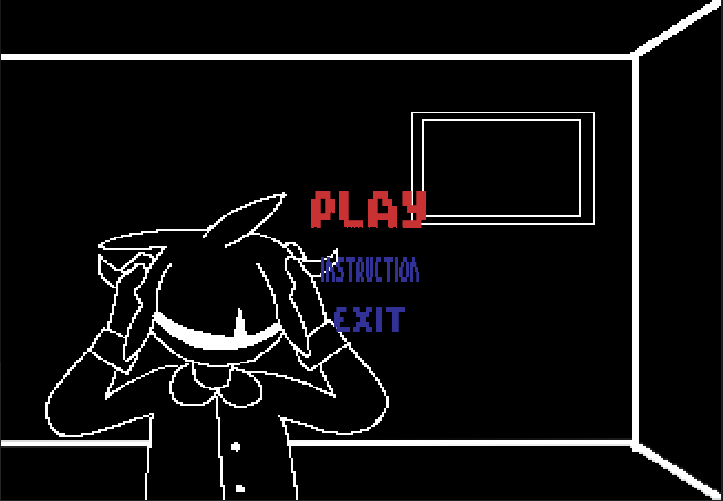
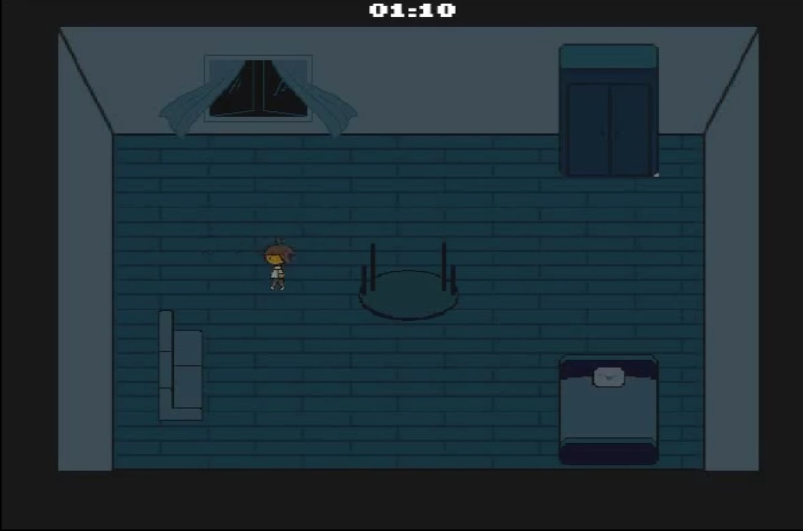
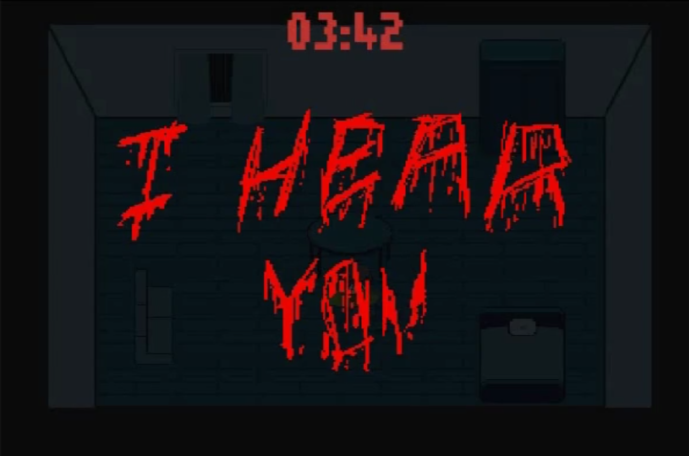
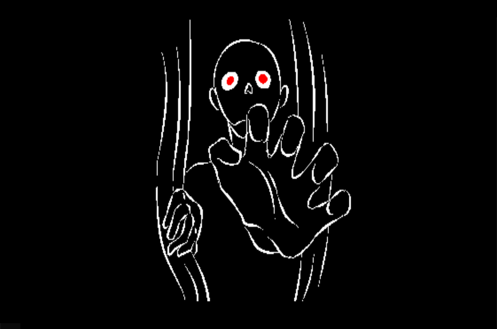

# Hide-Seek
The ‘Hide and Seek’ is a survival horror game. It focuses on the survival of the character throughout the game. Its objective is to scare the player using a scary ambiance and graphics. In addition, this game is controlled by a single player, which means that the game is designed to be played by one person at a time.

Game Folder -> https://github.com/DevDumDum/Hide-Seek/tree/master/Hide%26Seek_EXE

( download the "Hide&Seek_EXE" folder then run the Hide&Seek.exe ) 

Game demo -> https://www.youtube.com/watch?v=s9yl6I6REHw

 

This project was developed during my first year in college. SDL Library is used to manipulate images. Other than that, it is coded purely in C Language.

